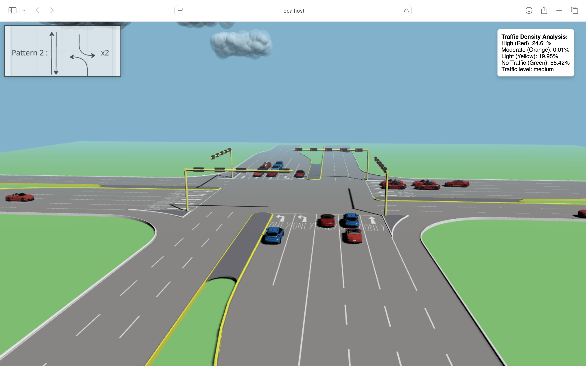

# Traffic Simulation with Real-Time Traffic Density Tracking and Congestion Control



This project simulates a 4-way intersection where cars are loaded based on real-time traffic density at a busy road junction in Bangalore. 

The project calculates traffic density using real-time Google Maps data, accessed through the [Google Maps JavaScript API](https://developers.google.com/maps/documentation/javascript/examples/layer-traffic#maps_layer_traffic-html). Based on the calculated density, cars are simulated in a 3D scene. The number of cars is dynamically adjusted to reduce congestion, following predefined thresholds.

---

## Features

- **Dynamic Signaling**:  
  Users can press the number keys `1` to `4` to change the signaling patterns and observe the traffic flow.

- **3D Visualization**:  
  Users can change camera angles to view the cars in a 3D environment.

---

## Instructions to Run the Project

### 1. Access the Project Online
- Visit the Vercel deployment link (provided in the repository).  
  **Note**: The online version cannot load Google Maps due to API key incompatibility with Vercel. It loads a high-density scene by default, similar to the offline mode.

---

### 2. Access the Project Locally
To run the project on your local machine:
1. Clone the repository:  
```bash
   git clone https://github.com/suchirmv-1524/Traffic-Simulation-and-Congestion-Control
```
2. Navigate to the project directory:
 ```bash
 cd Traffic-Simulation-and-Congestion-Control
```
3. Install the dependencies:
```bash
npm install
```
4. Start the development server :
```bash
npm run dev
```
5. Access the project at localhost in your browser

---

## Online vs. Offline Behavior
### Online Mode:
Google Maps is loaded, and traffic density is calculated based on real-time data.
Cars are loaded dynamically based on the number needed to reduce density to an ambient level.

### Offline Mode:
Google Maps is not loaded.
Traffic density is set to high by default, and the scene simulates the maximum number of cars.

---

## Dependencies
- Google Maps JavaScript API
- Node.js for local development.
- Three.js for 3D scene rendering.

---

## Authors
- Srivishnu Gade
GitHub: @SrivishnuGade
- Suchir M Velpanur
Github : @suchirmv-1524

Enjoy simulating and optimizing traffic flow in a dynamic 3D environment!